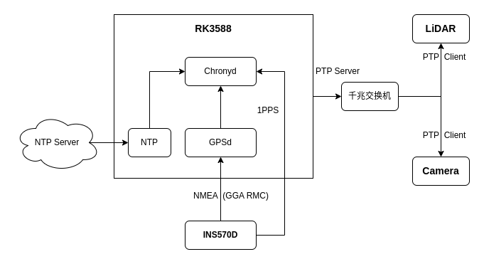

# MultiSensorFusion

多传感器数据采集、融合项目

## 项目目标

- 集成 INS（惯导系统）、LiDAR（激光雷达）和 Camera（工业相机）；
- INS 系统采集数据包括 IMU、RTK、CAN 轮速；
- LiDAR 采集点云数据，存储为 pcap 格式文件；
- Camera 采集图像数据，支持软触发和硬触发，存储为 jpeg 格式文件；
- 时间同步采用 PTP 协议，时钟源为 INS 的 GPS + PPS，精度小于 10 微秒；
- 实现 INS、LiDAR、Camera 空间对齐标定；
- 实现图像解算、点云解算和点图融合。

## 时间同步方案

## 测试环境

我们在 NanoPi R6S 开发板上进行测试，运行 Ubuntu 22.04 操作系统，可以参考《[RK3588 平台环境搭建](docs/Environment.md)》部署测试环境。

